# Arquitectura de Decilo

**Fecha:** 25 de septiembre de 2026.  
**Base inspeccionada:** [`e4b9f90`](https://github.com/dnluc/decilo/tree/e4b9f9075ba057b7f650ba492fa326aaf3fb1c77), incluyendo los PRs #20 (incremental), #21 (Gemini Live) y #22 (modelo local rápido y cortes textuales).
**Alcance:** implementación existente, decisiones, contratos y límites operativos. Los diagramas de evolución se identifican expresamente como propuestas.

Este documento describe lo que ejecuta el código. [VISION.md](../VISION.md) conserva la dirección del producto y [OpenSpec](../openspec/changes/) registra decisiones y tareas. Algunos diseños históricos describen etapas anteriores: por ejemplo, el motor implementado es **faster-whisper dentro del backend Python**, no un servicio whisper.cpp independiente.

## Índice

1. [Resumen y alcance funcional](#1-resumen-y-alcance-funcional)
2. [Drivers y decisiones](#2-drivers-y-decisiones)
3. [Contexto y despliegue actual](#3-contexto-y-despliegue-actual)
4. [Componentes y responsabilidades](#4-componentes-y-responsabilidades)
5. [Recorrido completo de una captura](#5-recorrido-completo-de-una-captura)
6. [Audio y protocolo de ingreso](#6-audio-y-protocolo-de-ingreso)
7. [Segmentación y transcripción incremental](#7-segmentación-y-transcripción-incremental)
8. [Proveedores e inferencia](#8-proveedores-e-inferencia)
9. [Traducción y concurrencia](#9-traducción-y-concurrencia)
10. [Sesiones y modelo de datos](#10-sesiones-y-modelo-de-datos)
11. [Eventos, snapshots y reconexión](#11-eventos-snapshots-y-reconexión)
12. [Frontend y experiencia de lectura](#12-frontend-y-experiencia-de-lectura)
13. [Colas, límites y cierre](#13-colas-límites-y-cierre)
14. [API y configuración](#14-api-y-configuración)
15. [Operación y diagnóstico](#15-operación-y-diagnóstico)
16. [Privacidad y límites de exposición](#16-privacidad-y-límites-de-exposición)
17. [Escalabilidad y evolución](#17-escalabilidad-y-evolución)
18. [Pruebas y evidencia](#18-pruebas-y-evidencia)

## 1. Resumen y alcance funcional

Decilo convierte audio de una pestaña del navegador en transcripción original y, cuando el original es inglés, traducción al español. El navegador reproduce el video y comparte su audio; Python coordina las sesiones, la segmentación, los modelos y la publicación de subtítulos. La inferencia puede ejecutarse localmente o mediante Gemini.

La arquitectura actual es un **backend modular en un único proceso**, acompañado de un frontend web y, para traducción local, Ollama. No hay microservicios por sesión, base de datos, broker de mensajes ni scheduler distribuido. Cada sesión tiene tareas asíncronas y estado propio, pero comparte recursos de inferencia.

| Capacidad | Implementación al corte de este documento |
| --- | --- |
| Captura de audio de pestaña | `getDisplayMedia` + AudioWorklet + WebSocket binario |
| Reproducción de YouTube | Iframe en el navegador; el servidor no descarga el video |
| Transcripción original | Inglés o español; local o Gemini |
| Traducción | Inglés → español; prompt orientado a charla técnica argentina |
| Selector local/nube | Por captura, fijado al iniciar; no cambia una sesión en curso |
| Idioma automático | Detección inicial con Whisper `small`, restringida a EN/ES |
| Texto provisional | Local: retranscripción con modelo rápido; nube Live: interims nativos del proveedor |
| Cortes variables | Local: pausas/máximo y heurística de oración; Live: finales del proveedor y cortes de texto |
| Traducción progresiva | Opcional, NDJSON de Ollama sobre originales finales |
| Gemini | Live STT `gemini-3.5-transcribe-live`; traducción/fallback REST `gemini-3.5-flash-lite` |
| Archivos WAV | Ruta de backend y scripts de medición; la UI actual se centra en pestañas |
| Audiencia | Eventos compartidos por sesión; conexión directa con `?session=<id>` |
| Múltiples sesiones | Admisión nominal de dos trabajos activos; capacidad real depende de hardware/proveedor |
| Persistencia | Ninguna para sesiones/subtítulos; historial reciente en RAM |
| Video para IA, diarización, glosario dinámico | Pendientes; no confundir el iframe con análisis visual |

## 2. Drivers y decisiones

| Driver | Decisión actual | Consecuencia y límite |
| --- | --- | --- |
| Reducir espera percibida | Transportar cada 100 ms y publicar hipótesis provisionales | El transporte frecuente no garantiza que la inferencia alcance esa cadencia |
| Calidad de frases | Pausas y fin de oración inferido; ASR final local o cierre Live | Heurística textual sin comprensión garantizada; Live puede confirmar una hipótesis sin final oficial |
| Tiempo de desarrollo | Python 3.12+, FastAPI, asyncio; frontend JavaScript con Vite | Menos componentes operativos; el cómputo pesado sigue dependiendo del runtime del modelo |
| Control de recursos | Colas acotadas, reemplazo de hipótesis pendientes y descarte explícito | Bajo sobrecarga puede perderse contenido y se publica un gap |
| Separación de sesiones | Estado y contexto de proveedor por sesión | CPU, memoria, thread pool y Ollama siguen siendo compartidos |
| Consistencia visible | Identidad de segmento, revisiones y finales inmutables | Una respuesta atrasada no debe reemplazar la revisión vigente |
| Costo y portabilidad | Funciones de despacho local/Gemini con el mismo contrato de subtítulos | Cambiar el proveedor no cambia los eventos, pero sí latencia, costo y capacidades |
| Recuperación | Snapshot reciente al conectar, más eventos secuenciales | No existe replay durable de toda la charla |
| Extensibilidad | Separación de captura, segmentación, ASR, traducción, estado y entrega | Hay puntos concretos de extensión; no están implementadas todas las interfaces conceptuales de la visión |

El objetivo histórico de **3 s p95** no se considera cumplido por esta arquitectura. Las pruebas cortas y la existencia de parciales tampoco acreditan calidad, capacidad sostenida o latencia hasta pantalla.

## 3. Contexto y despliegue actual

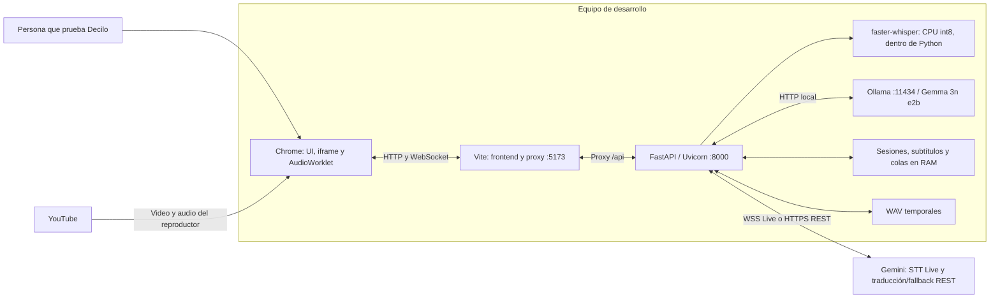

| Proceso o servicio | Puerto habitual | Función |
| --- | --- | --- |
| Vite | `127.0.0.1:5173` | Sirve frontend en desarrollo y reenvía `/api` con soporte WebSocket |
| Uvicorn | `127.0.0.1:8000` en el comando de demo | HTTP, captura, eventos y coordinación de inferencia |
| Ollama | `localhost:11434` | Traducción local; se inicia por separado del backend |
| Gemini | WSS / HTTPS externos | STT Live para captura; REST para traducción, archivos y fallback |

El frontend usa el mismo origen para HTTP y WebSockets. El proxy de desarrollo evita configurar CORS para ese recorrido. `/health` y `/health/ready` se consultan directamente al backend: el proxy de Vite solo cubre `/api`.

Vite no constituye el despliegue de producción. El repositorio construye `frontend/dist`, pero no trae un despliegue automático ni un servidor de producción que una esa carpeta con FastAPI. Ejecutar `python -m decilo.app` usa el `main()` que escucha en `0.0.0.0`; el comando explícito con `--host 127.0.0.1` mantiene la demo local.

## 4. Componentes y responsabilidades

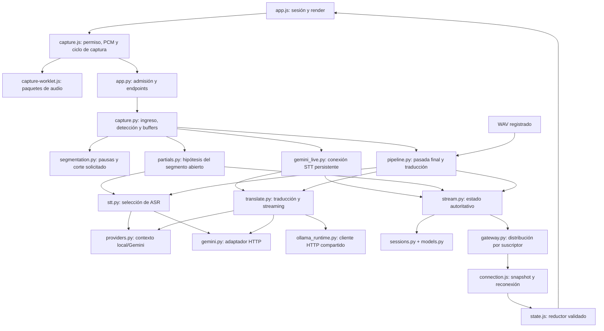

| Archivo | Responsabilidad y frontera |
| --- | --- |
| [app.py](../src/decilo/app.py) | Configuración, lifespan, catálogo, endpoints, registro de trabajos y admisión |
| [capture.py](../src/decilo/capture.py) | Valida paquetes, detecta idioma inicial, mantiene cola de audio y coordina cierre |
| [segmentation.py](../src/decilo/segmentation.py) | Pausas y máximo sobre PCM; acepta corte por timestamp inferido, sin llamar modelos |
| [partials.py](../src/decilo/partials.py) | Retranscribe instantáneas del segmento abierto y controla revisiones provisionales |
| [pipeline.py](../src/decilo/pipeline.py) | Archivos a ritmo real, ASR final, traducción, cola de traducción y observaciones de tiempos |
| [stt.py](../src/decilo/stt.py) | Caché/carga de Whisper, VAD, STT por proveedor y detección de idioma |
| [translate.py](../src/decilo/translate.py) | Prompt, llamada completa o streaming de traducción y preparación de Ollama |
| [providers.py](../src/decilo/providers.py) | `.env`, precedencia por etapa y `ContextVar` por captura |
| [gemini.py](../src/decilo/gemini.py) | REST generateContent, thinking configurable y clientes HTTP reutilizados |
| [gemini_live.py](../src/decilo/gemini_live.py) | Setup y conexión Live, interims/finales, cortes textuales y reconexión |
| [ollama_runtime.py](../src/decilo/ollama_runtime.py) | Un cliente HTTP async por lifespan/event loop; cierre explícito |
| [sessions.py](../src/decilo/sessions.py) | Registro en RAM y transiciones legales de sesión |
| [models.py](../src/decilo/models.py) | Tipos Pydantic y validaciones del contrato público |
| [stream.py](../src/decilo/stream.py) | Revisiones, secuencias, relaciones original/traducción y snapshots |
| [gateway.py](../src/decilo/gateway.py) | Colas por espectador, JSON de texto, desconexión de clientes lentos |
| [capture.js](../frontend/src/capture.js) | Captura real del navegador y socket de ingreso |
| [state.js](../frontend/src/state.js), [connection.js](../frontend/src/connection.js) | Validación y recuperación del estado de audiencia |
| [app.js](../frontend/src/app.js), [captions.js](../frontend/src/captions.js) | Historial, idiomas, revisiones y ritmo de la barra de subtítulos |
| [providers.js](../frontend/src/providers.js), [video.js](../frontend/src/video.js) | Preferencia local/nube y carga del iframe |

No existe una jerarquía de clases `Transcriber`/`Translator` con plugins. La separación actual se realiza con módulos, funciones y despacho por proveedor; es el punto de partida para abstraer implementaciones futuras.

## 5. Recorrido completo de una captura

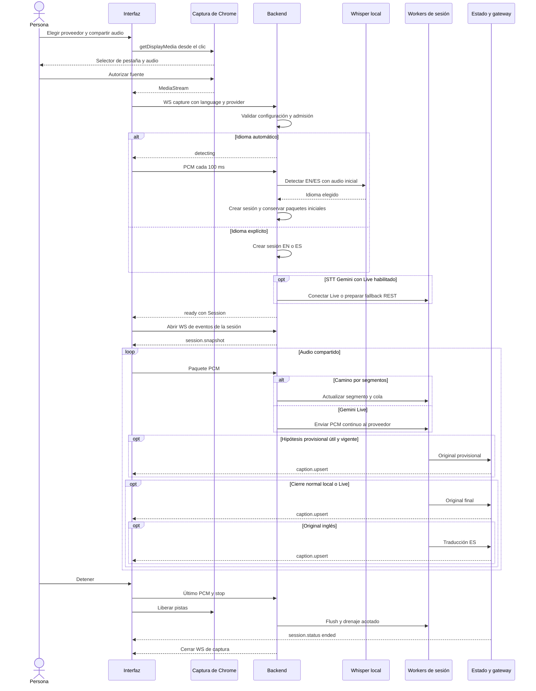

Existen **dos WebSockets diferentes**:

- **Ingreso:** navegador capturador → `/api/v1/capture`. Transporta audio binario y control de captura.
- **Audiencia:** `/api/v1/sessions/{id}/events` → espectadores. Transporta estado y subtítulos JSON, sin audio.

La separación permite que muchos espectadores compartan los resultados de una única inferencia. Abrir otra página de audiencia no retranscribe la sesión. El diagrama muestra la publicación normal; la confirmación residual de Live al cerrar/reconectar tiene un comportamiento distinto, descrito en 8.5.

### Autodetección de idioma

La UI ofrece `auto` por defecto; la API, si se omite `language`, usa `en`. Con `auto`, el backend no crea la sesión hasta identificar su idioma:

1. Envía `{"type":"detecting"}` para que el cliente empiece a transmitir.
2. Conserva los paquetes completos mientras acumula aproximadamente 2,5 s de audio que supera un umbral de energía, o alcanza 12 s de audio total. El control se evalúa por paquete, por lo que el último puede superar el umbral.
3. Ejecuta Whisper `small` y elige la probabilidad mayor entre `en` y `es`.
4. Crea la sesión y entrega los mismos paquetes al procesamiento habitual.

La energía no es un detector lingüístico. Al alcanzar el tope, el código intenta detectar incluso si no reunió 2,5 s de voz. No hay umbral de confianza ni estado «idioma desconocido»; si faltan ambas probabilidades, la comparación actual elige inglés. `stop`, desconexión, entrada inválida o timeout pueden impedir crear la sesión.

**Esta detección siempre es local**, aunque se seleccione Gemini para STT/traducción. Elegir EN/ES explícitamente evita esa etapa y su carga de modelo. El idioma se fija para toda la sesión; no hay cambios automáticos a mitad de charla.

## 6. Audio y protocolo de ingreso

### Captura y transformación

`getDisplayMedia` solicita una fuente de video con audio, preferentemente una pestaña. Chrome exige la autorización de la persona. Decilo utiliza únicamente las pistas de audio para el backend: no envía frames del video ni solicita micrófono.

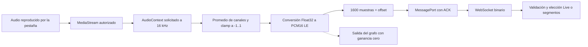

El `AudioContext` debe informar 16 kHz; si no puede, se rechaza la preparación. El worklet mezcla los canales en mono, limita amplitudes y cuantiza a enteros de 16 bits. Su salida se conecta a una ganancia cero: conserva el procesamiento del grafo sin reproducir el audio por segunda vez. El sonido audible procede del reproductor original.

### Paquete binario

| Posición | Tipo | Significado |
| --- | --- | --- |
| Bytes 0–3 | `uint32` little-endian | Posición inicial en muestras desde el comienzo de la captura |
| Bytes 4 en adelante | `int16[]` little-endian | PCM mono a 16.000 muestras por segundo |

Un paquete normal contiene **1.600 muestras / 100 ms**, ocupa **3.204 bytes** y se envían aproximadamente diez por segundo. Son **32.040 bytes/s por captura**, sin contar framing WebSocket/TCP/TLS. Actualmente no hay Opus ni compresión de audio en este enlace.

El backend acepta entre 1 y 80.000 muestras por paquete, exige offset sin retrocesos/solapamientos y limita el final a una hora de muestras. Un salto de offset representa audio faltante. En el camino por segmentos se cierra el segmento previo, se publica un gap y se reinicia el segmentador en el nuevo offset. Live publica el gap sin insertar ese tiempo faltante en su contador de muestras; ver 8.4.

En el camino por segmentos, los tiempos de subtítulos se calculan con `muestras × 1000 / 16000`. Live combina actividad de voz del proveedor con cantidad de audio enviado: su final no es alineación exacta por palabra; ver 8.4. Son relativos a la captura, **no al minuto absoluto del video de YouTube**. El navegador y Python no comparten un reloj monotónico.

El texto literal `stop` termina el ingreso y solicita drenaje. `ready` y `detecting` son mensajes de control de captura; no usan el envelope versionado del WebSocket de audiencia.

## 7. Segmentación y transcripción incremental

### 7.1 Límites acústicos

`PauseSegmenter` trabaja con cuadros de análisis de 20 ms, independientes de los paquetes de transporte. Conserva muestras y produce `AudioSegment(pcm, start, end, reason, has_voice)`.

| Parámetro por defecto | Valor | Función |
| --- | --- | --- |
| Duración mínima | 1 s | Evita cerrar demasiado pronto por pausa |
| Silencio para corte | 0,4 s | Pausa consecutiva después de actividad |
| Duración máxima | 6 s | Cierra incluso con habla continua |
| Umbral RMS normalizado | 0,01 | Señal acústica de actividad |
| Cuadro de análisis | 20 ms | Granularidad del análisis, no frecuencia de inferencia |

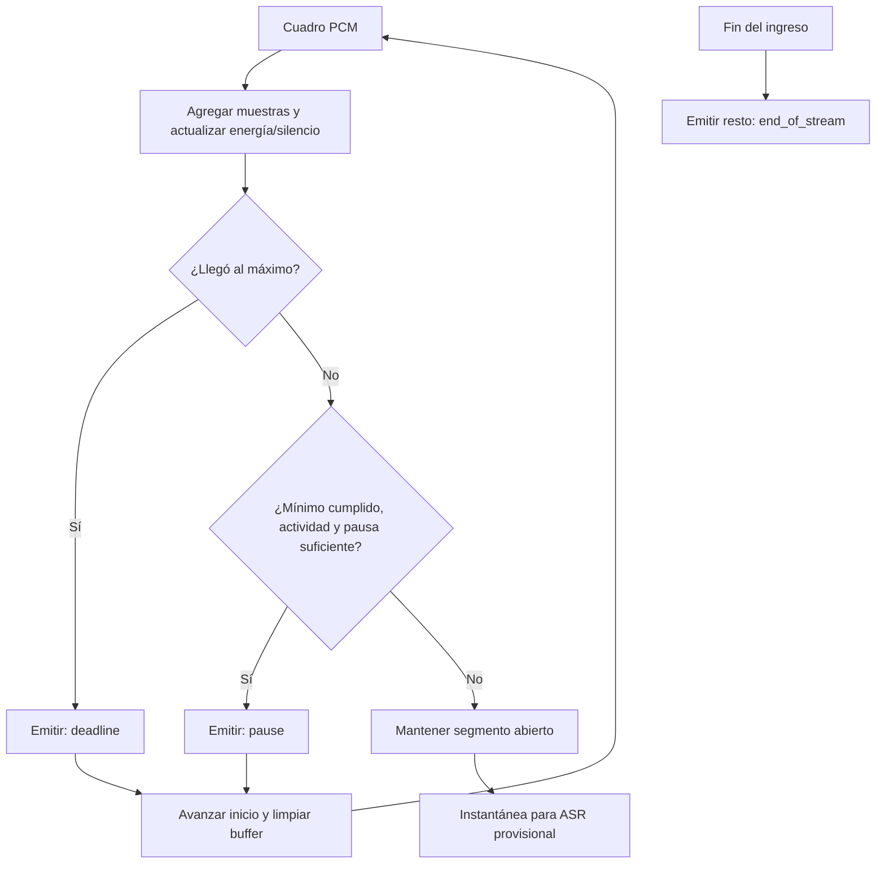

`deadline` tiene prioridad cuando se alcanza el máximo. Los segmentos sin actividad acústica se omiten sin invocar ASR final. El filtro de energía puede considerar música o ruido como actividad; el VAD posterior de Whisper aborda otro nivel del problema.

`DECILO_SEGMENTATION=fixed` desactiva esta segmentación. En archivos se usan ventanas de 5 s; **en captura cada paquete recibido se convierte en unidad de procesamiento**. Por eso el modo `fixed` no es equivalente entre ambas fuentes y no conviene interpretarlo como un baseline de 5 s para el worklet actual de 100 ms.

### 7.2 Corte textual local por fin de oración

El PR #22 conecta las hipótesis de Whisper con `CaptureBuffer.sentence_break` y
`PauseSegmenter.split_open`. `transcribe_segments` conserva texto y fin en segundos
de cada segmento reconocido. Se busca un límite **interno**: debe existir otro
segmento después; no alcanza el punto final de la última hipótesis.

La heurística exige al menos 12 caracteres acumulados, terminación `.`, `!`, `?`
o `…`, evita el caso con dígito inmediatamente anterior al signo y acepta cortes
desde 2 s. Usa el último límite elegible y el timestamp de Whisper para separar
PCM; el audio posterior permanece como inicio de un segmento nuevo. Pausas y
máximo acústico continúan como respaldo. Sin parciales no llega esta señal textual.

Es una aproximación por puntuación/timestamps inferidos, no comprensión de unidades
de sentido. `split_open` emite `boundary_reason=pause`, igual que un corte acústico;
`semantic` existe en el contrato, pero no se emite. En fallback Gemini REST no hay
lista de timestamps (solo un texto con fin 0), por lo que no opera este corte local.

**Frontera pendiente de validación:** se publica la hipótesis completa antes de
pedir el corte interno. Su `end_ms` puede superar el límite propuesto para la
pasada final del mismo segmento; el contrato prohíbe retroceder ese final temporal.
Los tests del callback de corte no equivalen a validar esta secuencia completa
con `SessionStream`. No se cambió esa regla de contrato para declarar el corte aprobado.

### 7.3 Hipótesis del segmento abierto

En el camino por segmentos, con pausas y `DECILO_PARTIALS=1` —default actual— la captura activa `PartialTranscriber`. Live no utiliza este worker:

- La primera instantánea necesita al menos 0,8 s de audio abierto con actividad.
- Para otra instantánea deben sumarse al menos 0,5 s de audio respecto de la anterior.
- Solo existe una inferencia provisional activa por captura y una instantánea pendiente reemplazable por la más reciente.
- Se retranscribe **todo el segmento abierto**; no hay ventana deslizante ni decodificador ASR que conserve estado entre llamadas.
- Local usa el modelo rápido `base` con `beam_size=1` para parciales y `small` con `beam_size=5` para la pasada final; ES puede configurarse con otro tamaño.
- Al cerrar el segmento se reserva la siguiente revisión final y se descarta cualquier provisional que llegue tarde.

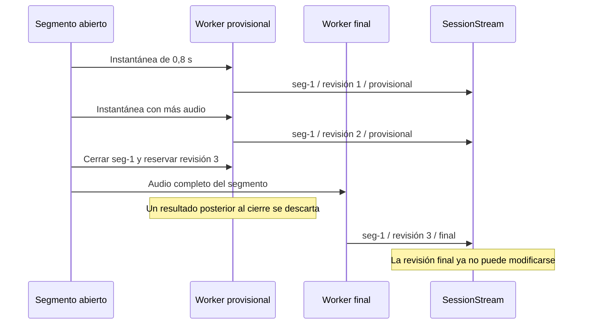

La identidad la asigna `CaptureBuffer` según el inicio del segmento. El original provisional y el final comparten `segment_id`, `segment_seq` y `start_ms`; aumenta `revision` y puede crecer `end_ms`. Se reemplaza el texto provisional completo: **no existe un campo de prefijo de palabras ya congeladas**.

Los parciales son originales; no se traducen especulativamente. La traducción empieza después del original final. En el fallback Gemini por segmentos, esta estrategia provoca solicitudes repetidas de `generateContent`; `beam_size` y `fast` no tienen efecto en ese adaptador. Puede aumentar costo y contención. `DECILO_PARTIALS=0` desactiva este worker y su señal de corte textual, pero no los interims nativos de Live.

Si la pasada final devuelve texto vacío después de haber publicado parciales, se retiran mediante `session.gap` con `discard_captions`. Esto evita dejar una hipótesis visible como resultado confirmado. No todos los fallos finales eliminan automáticamente parciales: el error de STT publica un gap sin lista de descarte.

El procesamiento de archivos reutiliza la pasada final y la traducción, pero **no activa `PartialTranscriber`**.

## 8. Proveedores e inferencia

### 8.1 Precedencia

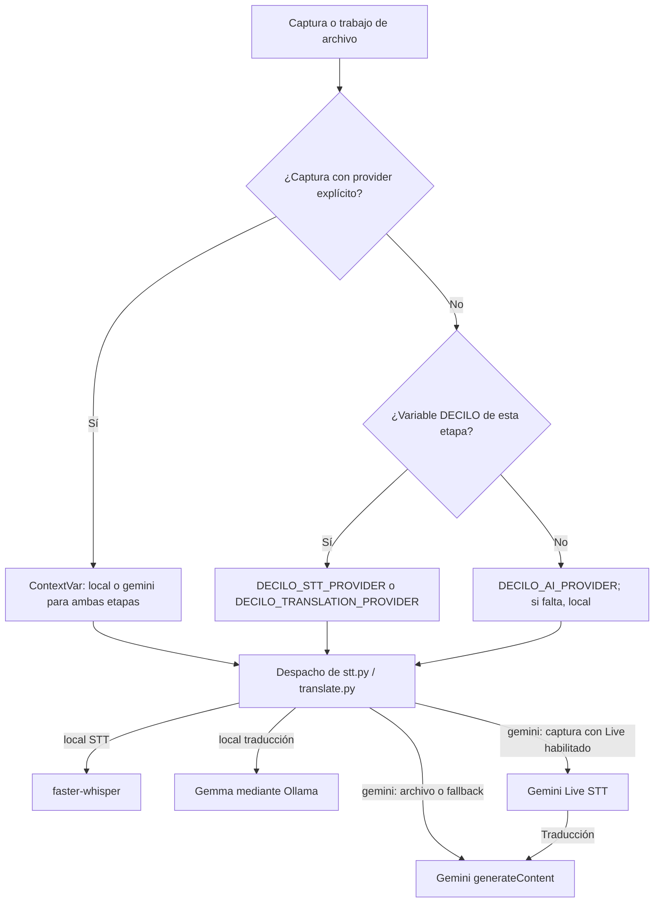

La carga de `.env` usa `override=False`: las variables ya exportadas ganan. `DECILO_ENV_FILE` permite elegir explícitamente el archivo, evitando que arrancar desde otro worktree deje el backend sin configuración.

El contexto por sesión se establece antes de crear sus workers. `asyncio.create_task` y `asyncio.to_thread` lo propagan. Se restaura en `finally`, también ante errores. No se modifica `os.environ` al cambiar el selector de la interfaz.

Los clientes sin `provider` y los trabajos de archivo pueden usar una combinación híbrida, por ejemplo Whisper para STT y Gemini para traducción. La UI actual ofrece solo **todo local** o **ambas etapas en Gemini** para una captura.

`GET /api/v1/providers` publica `default` y `cloud_available`. La segunda propiedad indica presencia de una clave, no valida saldo, cuota ni acceso al modelo. La UI guarda su selección en `localStorage`; sin preferencia previa, adopta `default` cuando la API informa nube disponible. Sin catálogo válido o sin clave conserva/vuelve a local. Esa preferencia del navegador es independiente del entorno del servidor.

### 8.2 Camino local

**STT:** faster-whisper se carga de forma diferida dentro del proceso Python. Usa CPU, cuantización `int8` y modelo final `small` para EN y ES. `DECILO_WHISPER_ES` permite sustituir el final ES (por ejemplo `medium`); `DECILO_WHISPER_FAST` cambia el modelo provisional, default `base`. Un lock por tamaño evita construir dos copias del mismo modelo en un arranque concurrente. Ese lock protege la carga, no serializa toda la inferencia. Cada modelo recibe `cpu_threads=max(4, (os.cpu_count() or 8) // 2)`: son threads por modelo, sin afinidad ni reserva exclusiva de media CPU. El mínimo de cuatro puede superar la mitad en equipos pequeños.

Las llamadas bloqueantes se despachan a threads. `vad_filter=True`, `condition_on_previous_text=False` y `no_speech_threshold=0.6` ayudan a filtrar audio sin habla y a evitar arrastrar hipótesis previas. No garantizan ausencia de alucinaciones.

**Traducción:** `POST http://localhost:11434/api/chat`, modelo `gemma3n:e2b`. Ollama corre por separado. El cliente `httpx.AsyncClient` se comparte dentro del mismo lifespan/event loop y se cierra al salir. El prompt pide español natural para una charla técnica en Argentina y conservación de términos habituales.

En la respuesta local no streaming se conserva solo el primer bloque anterior a `\n\n`, para descartar variantes agregadas por el modelo. El camino de streaming no aplica ese recorte y puede producir otra salida.

El prompt no equivale a un motor de glosario: no hay tablas global/evento/sesión, memoria contextual acumulada ni selección de perfiles regionales. `target_locale` es metadata; la traducción usa el prompt fijo actual.

### 8.3 Gemini por REST: traducción, archivos y fallback

`gemini.py` llama a:

```text
POST https://generativelanguage.googleapis.com/v1beta/models/{model}:generateContent
```

El modelo predeterminado es `gemini-3.5-flash-lite`, reemplazable por `DECILO_GEMINI_MODEL`. Para STT se envía un WAV en base64 mediante `inlineData`; para traducción, texto. La clave viaja en el header `x-goog-api-key`, nunca en la URL ni al frontend.

Cada solicitud usa temperatura 0 y máximo 2.048 tokens de salida. `DECILO_GEMINI_THINKING` agrega `thinkingLevel`, default `MINIMAL`; dejarlo vacío omite `thinkingConfig` si el modelo elegido no lo admite. Solo se acepta una respuesta con `finishReason=STOP` y texto no vacío; se excluyen partes marcadas como pensamiento. El adaptador de audio rechaza archivos de más de 2.000.000 bytes.

Hay timeout HTTP de 30 s y no hay reintentos dentro de este adaptador REST.
El cliente síncrono se comparte a nivel de módulo y los clientes async se cachean
por `id(event_loop)`. STT síncrono corre en thread; traducción usa async. A diferencia
del cliente de Ollama, estos clientes todavía no se cierran desde el lifespan.
La reutilización reduce conexiones nuevas, pero requiere completar su gestión de recursos.

### 8.4 Gemini Live: camino de captura en nube

Cuando `provider('stt') == 'gemini'` y `DECILO_GEMINI_LIVE` no es `0`,
`receive_capture` intenta Live **después de crear la sesión** y antes de enviar
`ready`. Con `auto`, la detección inicial local ocurre antes de todo esto.

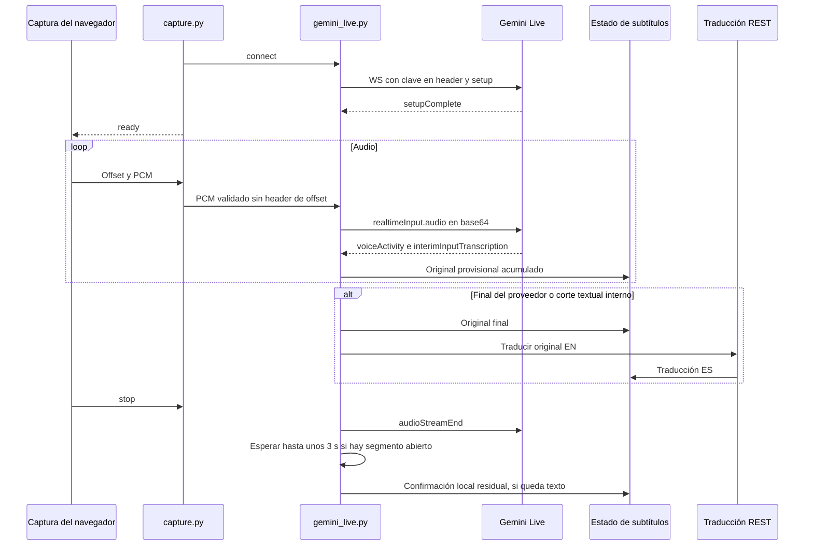

Setup: WebSocket `BidiGenerateContent` v1beta, clave en `x-goog-api-key`, modelo
`gemini-3.5-transcribe-live` por defecto y `responseModalities=['TEXT']`.
`inputAudioTranscription` declara idioma y modo `SMART`; este modo solicita
limpiar muletillas/autocorrecciones, por lo que no se describe como transcripción
verbatim. `DECILO_GEMINI_LIVE_MODEL` configura el modelo de esta conexión, separado
del modelo REST de traducción.

Cada paquete se valida y su PCM se codifica en base64 con MIME
`audio/pcm;rate=16000`. No se envía el header de offset a Google. Este camino no
usa `PauseSegmenter`, WAV temporales de STT, worker provisional local ni cola de
audio segmentada. Espera cada envío; la presión puede acumularse en transporte.

El lector consume actividad de voz y texto acumulado. `interimInputTranscription`
produce revisiones; `inputTranscription` confirma. La traducción nace de
`_finalize`, usando el consumidor opcional de cola o esperando la traducción
inline. Sin cola, esa espera también frena al lector de mensajes Live.

**Corte textual Live:** una regex busca puntuación interna seguida por espacio
y comienzo de nueva oración (mayúscula, número o signos de apertura). Confirma
el prefijo hasta el último límite detectado y deja la cola como otro segmento.
`committed` evita volver a publicar texto ya confirmado; `committed_final`
distingue continuación de un buffer y el comienzo de otro. No usa tiempos de
palabras ni el mínimo de 2 s del corte local.

**Tiempos:** el inicio usa `voiceActivity.audioOffset` cuando llega, más una base
por conexiones anteriores; si no está, usa audio enviado. El final usa muestras
enviadas en ese momento. Un corte textual también usa esos valores aproximados.
Los offsets faltantes se informan como gaps, pero no se reinsertan como silencio
ni se agregan a ese contador de Live: después de pérdidas puede diferir del reloj
de captura original. Los finales normales/textuales se etiquetan `pause`, no `semantic`.

### 8.5 Reconexión, fallback y semántica de final

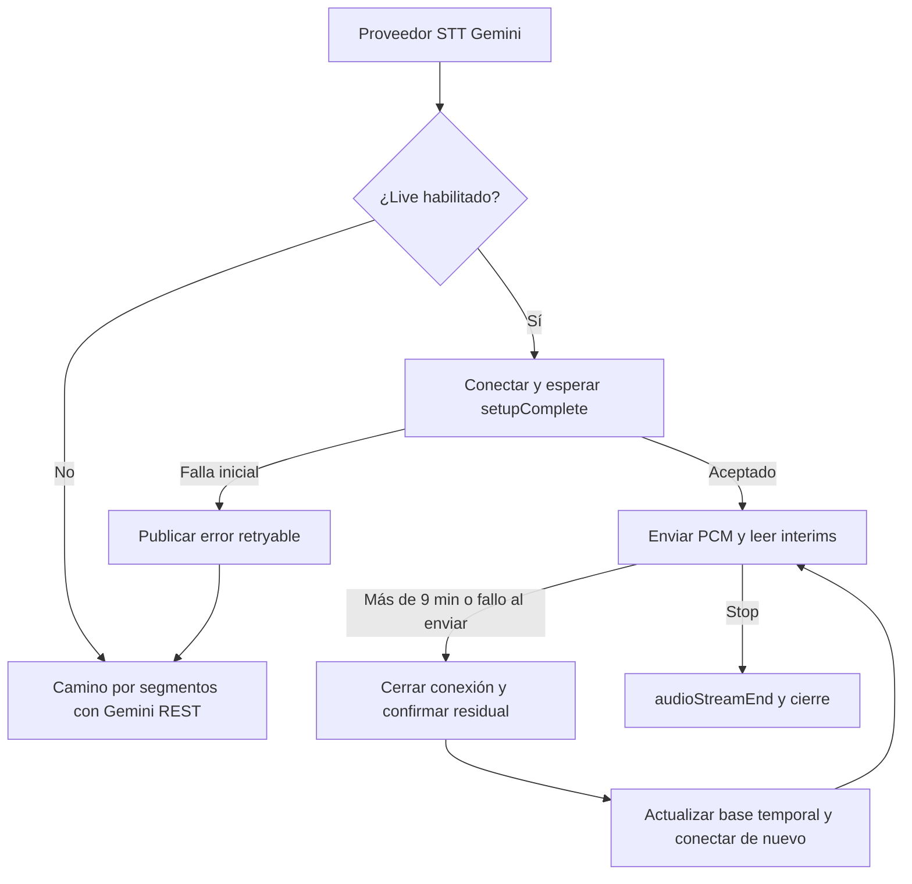

El código renueva después de nueve minutos cuando llega otro paquete y también
reconecta ante error al enviar, reenviando ese mensaje una vez. Conserva numeración
de segmentos y acumula una base de muestras; no conserva contexto remoto ni un
log durable. No se garantiza cero pérdidas/duplicados en reconexión. Un fallo
irrecuperable durante Live termina ese recorrido; el fallback a REST se aplica
al **inicio**, no como recuperación general a mitad de la sesión. Nunca cambia
silenciosamente de Gemini a Whisper.

**Diferencia respecto del contrato objetivo:** al terminar, reconectar o recibir
una reescritura que no puede alinear, `_confirm_open_segment` convierte la última
provisional a `final` con `end_of_stream`. Esa confirmación puede no provenir de
una final oficial. Además, ese método no solicita traducción; el último fragmento
puede quedar solo en original. El contrato estructural admite el evento, pero el
requisito de no confirmar texto incierto por el mero cierre sigue pendiente de
reconciliar. Se documenta el comportamiento, no se declara esa divergencia resuelta.

Los errores de conexión Live se incluyen en mensajes hacia la audiencia; deben
revisarse su sanitización y limpieza de recursos cuando falla un setup parcialmente
abierto. Este inventario documental no modifica el código ni demuestra esas garantías.

## 9. Traducción y concurrencia

### Camino serial y cola opcional

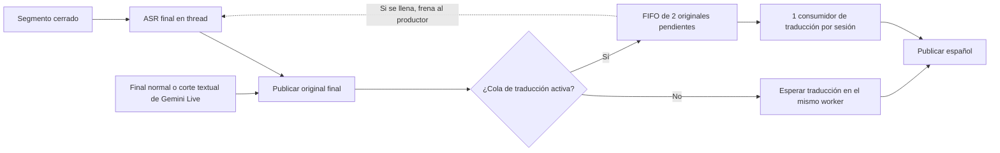

Con `DECILO_TRANSLATION_QUEUE=1`, ASR puede avanzar mientras se traduce un original anterior. Hay hasta dos textos pendientes más una traducción activa. Al llenarse la cola, `await queue.put` espera: la cola no crea solicitudes ilimitadas. En el camino por segmentos, ese freno puede terminar llenando la cola anterior de audio, donde sí hay descarte. En Live detiene la lectura de mensajes del proveedor; el transporte de audio no usa esa cola segmentada.

Sin el flag, el worker espera STT y traducción de cada segmento antes de pasar al siguiente. La cola no se crea para una sesión ES que no tiene idiomas de traducción.

### Streaming de traducción

Con `DECILO_STREAM_TRANSLATION=1`, Ollama entrega NDJSON. El backend acumula contenido y publica revisiones provisionales, como máximo aproximadamente cada 300 ms; el final se entrega sin esperar ese intervalo. Solo confirma ante `done=true`, `done_reason=stop` y texto válido.

El parser limita el flujo a 1 MiB, cada línea/buffer a 65.536 bytes y el texto al límite del contrato de 8.192 bytes UTF-8. Timeout, cierre sin confirmación o truncamiento producen error, no un final inventado.

Para Gemini, activar ese flag produce una sola actualización final: el adaptador no entrega tokens parciales. En ambos proveedores, la traducción recibe un original **ya final** y conserva su `source_revision`.

### Modelo real de concurrencia

En el camino por segmentos, cada captura puede tener recepción, un worker de ASR final, un worker provisional y un consumidor de traducción opcional. Live usa una tarea lectora del proveedor y envío desde el ingreso, más traducción opcional; no levanta los dos workers de ASR local. El provisional y el final son caminos concurrentes distintos; **no hay una única inferencia global serializada**. Comparten thread pool, CPU, caché de Whisper y los servicios externos.

Cancelar una tarea que espera `asyncio.to_thread` no detiene por sí solo el cómputo nativo ya iniciado. Descartar el resultado de una llamada tardía tampoco recupera su CPU ni el costo de una solicitud remota. Por eso cantidad de tareas, latencia y presupuesto de inferencia deben medirse por separado.

## 10. Sesiones y modelo de datos

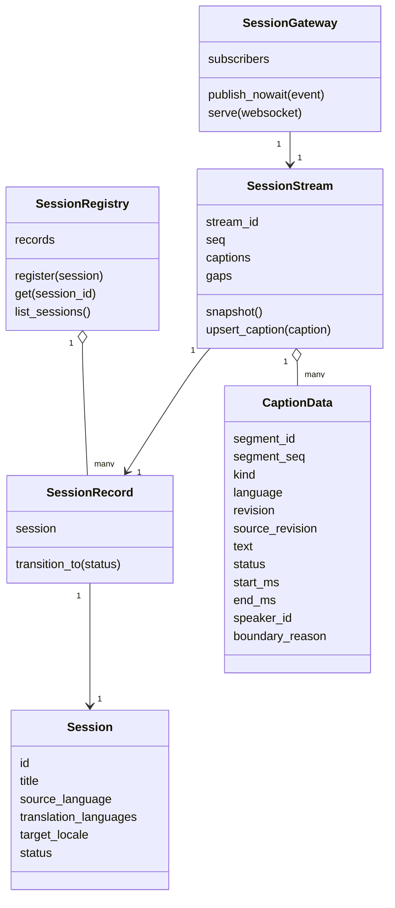

`SessionRegistry` y `SessionStream` comparten el mismo `SessionRecord`: la API HTTP y el stream no mantienen copias independientes del estado de sesión. `stream_id` identifica la instancia del flujo; se genera al construir `SessionStream`. Reiniciar el proceso pierde el registro y el historial.

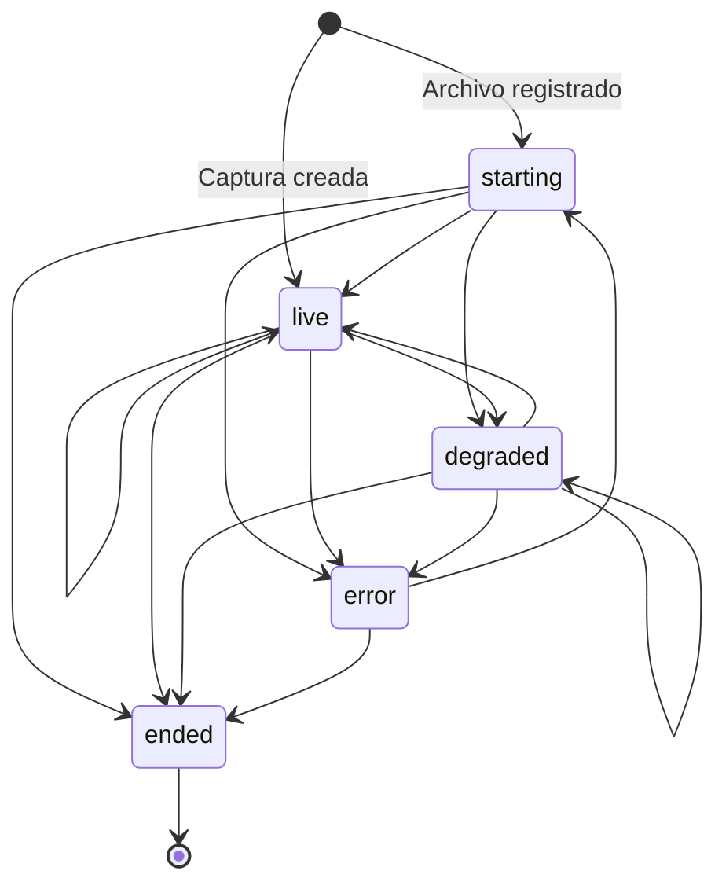

El diagrama representa transiciones **permitidas por el modelo**, no una política automática implementada para todas ellas. Publicar `session.error` o `session.gap` no cambia por sí solo el estado a `error` o `degraded`. La captura termina normalmente en `ended` aun si durante ella se informaron errores. El worker de archivos puede pasar a `error` ante una excepción no recuperada.

`speaker_id` existe como campo opcional, pero los workers no realizan diarización ni lo completan. Los idiomas públicos del backend son `en` y `es`; una etiqueta visual para otro idioma no implica soporte de inferencia.

## 11. Eventos, snapshots y reconexión

### Envelope público v1

Todo evento de audiencia incluye `protocol_version`, `session_id`, `stream_id`, `seq`, `emitted_at`, `type` y `data`. `emitted_at` es una fecha UTC útil para trazabilidad, no una medición de latencia entre relojes distintos.

Ejemplo ilustrativo de un original provisional —no salida de una prueba real—:

```json
{
  "protocol_version": 1,
  "session_id": "capture-ejemplo",
  "stream_id": "abc123def456",
  "seq": 4,
  "emitted_at": "2026-09-25T14:00:00Z",
  "type": "caption.upsert",
  "data": {
    "segment_id": "seg-1",
    "segment_seq": 1,
    "kind": "transcript",
    "language": "en",
    "revision": 2,
    "source_revision": null,
    "text": "Before merging the PR",
    "status": "provisional",
    "start_ms": 0,
    "end_ms": 1800,
    "speaker_id": null,
    "boundary_reason": null
  }
}
```

| Evento | Semántica |
| --- | --- |
| `session.snapshot` | Estado reciente completo al suscribirse: sesión, captions, gaps y truncamiento |
| `caption.upsert` | Inserta o reemplaza una revisión de subtítulo |
| `session.status` | Publica un cambio legal de estado de sesión |
| `session.error` | Error con código, mensaje y señal `retryable`; no implica reintento automático de IA |
| `session.gap` | Intervalo perdido o invalidación explícita de provisionales |

### Identidad e invariantes

La clave de un subtítulo es `(segment_id, kind, language)`. `segment_seq` ordena segmentos de audio; `revision` ordena versiones de un subtítulo; `seq` ordena **todos** los eventos de la sesión. No son contadores intercambiables.

1. El `segment_seq` y el inicio del segmento son inmutables; su final no retrocede.
2. Las revisiones avanzan. Duplicados/obsoletos se ignoran sin consumir otra secuencia.
3. Un subtítulo `final` es inmutable. Una corrección posterior necesitaría otro mecanismo de contrato.
4. Una traducción requiere original vigente, mismos tiempos y `source_revision` exacta.
5. Cambiar el original invalida la traducción de su revisión anterior; una traducción tardía no la resucita.
6. Una traducción final requiere original final; el original final no confirma automáticamente la traducción.
7. Un gap puede retirar originales/traducciones provisionales, pero no borrar finales mediante `discard_captions`.
8. Texto: máximo 8.192 bytes UTF-8. Contadores y timestamps: enteros estrictos dentro del rango seguro de JavaScript.

### Snapshot y recuperación

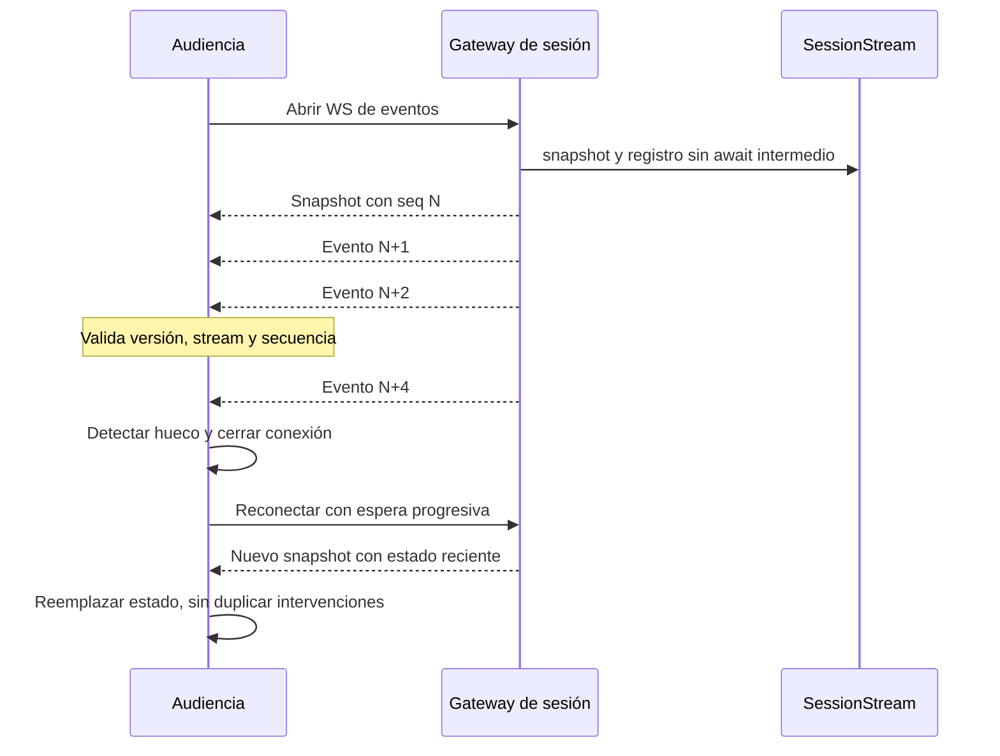

El snapshot no consume una secuencia nueva: representa el último `seq`. Snapshot y alta del suscriptor ocurren sin `await` intermedio en el mismo event loop, evitando perder eventos entre ambos pasos.

Se conservan hasta 100 segmentos y 100 gaps; el snapshot debe caber en 1 MiB. Si hace falta, se eliminan segmentos completos con sus traducciones y luego gaps antiguos. `history_truncated` informa que ya no está todo el historial.

El cliente espera snapshot durante 10 s. Reconecta con espera exponencial desde unos 500 ms hasta 10 s y variación aleatoria. Ante `stream_id` distinto recupera un estado nuevo; ante una versión incompatible detiene la recuperación automática. No usa offsets de replay ni recibe un log persistente.

## 12. Frontend y experiencia de lectura

La UI es JavaScript con módulos ES, HTML y CSS; no usa React ni un servidor de renderizado. Vite resuelve desarrollo/build. El estado de audiencia se procesa con un reductor que valida antes de aplicar cambios, de modo que un evento inválido no deje una actualización parcial.

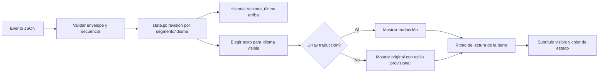

La barra y el historial distinguen provisional/final por estilo. Si se eligió español y todavía no llegó la traducción, la UI muestra el original como provisional. Esto evita el cartel «Traduciendo», pero **ver texto temprano no significa que ya llegó español**. Debe distinguirse al medir latencia percibida de traducción.

`createCaptionPacer` sostiene cada subtítulo entre 1.600 y 7.000 ms, con una referencia de 18 caracteres/s. Una revisión del mismo segmento se actualiza en el lugar sin reiniciar la espera. Al drenar, si hay más de tres pendientes salta al último para evitar una barra excesivamente atrasada. Esa decisión de presentación no borra el historial reciente; tampoco convierte al historial en almacenamiento ilimitado.

La página admite `?session=<id>` para adjuntarse a una sesión conocida. La captura nueva selecciona su sesión automáticamente. El catálogo existe en la API, pero la pantalla principal actual no ofrece un listado completo de escenarios como producto terminado.

Los errores/avisos se insertan como texto DOM, no HTML proveniente del modelo. Hay controles de tamaño, modo de lectura y anuncios accesibles de resultados finales. Recargar la pestaña capturadora libera su captura: recuperar un snapshot no reanuda el audio automáticamente.

## 13. Colas, límites y cierre

### Presupuestos implementados

Las filas de segmentación/ASR provisional/cola de audio corresponden al camino por
segmentos. Live conserva límites del ingreso, audiencia y traducción, pero no
hereda un máximo acústico de 6 s ni el presupuesto de 12 s de la cola de segmentos.

| Frontera | Límite o política | Qué sucede al saturarse |
| --- | --- | --- |
| Worklet → hilo principal | Hasta 16 paquetes pendientes, además del entregado esperando ACK | Descarta el más antiguo, informa muestras perdidas y conserva salto de offset |
| Hilo principal → WebSocket | `bufferedAmount > 320008` bytes | Detiene captura y muestra problema de conexión |
| Paquete recibido | 1–80.000 muestras; duración total hasta 1 h | Rechaza formato, orden o duración inválidos |
| Segmentador por defecto | 6 s de segmento más resto de un cuadro de análisis | Emite `deadline` al alcanzar el máximo |
| Cola de audio con pausas | `2 × max_seconds` de PCM pendiente; default 12 s | Descarta segmentos pendientes más antiguos y publica `overload` |
| Cantidad de segmentos pendientes | `ceil(2 × max_seconds / min_seconds) + 1`; default 13 | Mismo descarte; también rige el presupuesto en muestras |
| Captura sin segmentador | Dos paquetes pendientes / presupuesto 10 s | Descarta el más antiguo; el tamaño real depende del emisor |
| ASR provisional por segmentos | Un activo y una instantánea pendiente | Reemplaza la pendiente; no cancela la inferencia activa |
| Live setup | Espera de `setupComplete` hasta 10 s después de conectar | Fallback inicial a Gemini REST |
| Live renovación | Comprobación a los 9 min al enviar audio | Nueva conexión, base de muestras y secuencia conservadas |
| Live finalización | Hasta ~3 s de espera si hay segmento abierto | Confirma provisional residual localmente y cierra |
| Traducción con cola | Dos originales pendientes y un activo | Espera del productor |
| Archivo atrasado | Más de 10 s desde disponibilidad de un segmento | Omite ese segmento con gap `overload` |
| Historial backend/frontend | Hasta 100 segmentos y 100 gaps | Evicción de historial reciente y señal de truncamiento |
| Mensaje de audiencia | 1 MiB | No se publica un mensaje mayor |
| Suscriptor de audiencia | 64 mensajes o 2 MiB, incluyendo envío activo | Cierre 4008; puede reconectar para recuperar snapshot |
| Envío a espectador | Timeout de 10 s; cierre acotado a 1 s | Aísla al cliente lento |
| Inactividad de captura | 15 s sin un nuevo mensaje | Finaliza ingreso con error/gap |
| Drenaje del backend | 90 s compartidos por audio y traducción tras fin del ingreso | Cancela tareas y publica error si vence |
| Cierre del navegador | Espera de flush hasta 500 ms; watchdog de socket 95 s | Libera recursos y acota espera de finalización |

El presupuesto de 12 s cubre audio **pendiente en cola**. No incluye el segmento abierto, el que se procesa, las instantáneas provisionales, buffers de transporte ni el modelo en memoria. No constituye un límite de latencia total de 12 s.

Los saltos de offset actualmente se etiquetan `source_disconnect`, aunque también pueden venir del descarte del worklet. Se informa la pérdida, pero esa razón no distingue con precisión fallo de fuente y congestión de transporte.

### Cierre y propiedad de recursos

El diagrama siguiente corresponde al camino por segmentos. El cierre específico
de Live y su confirmación residual se describen en 8.4–8.5.

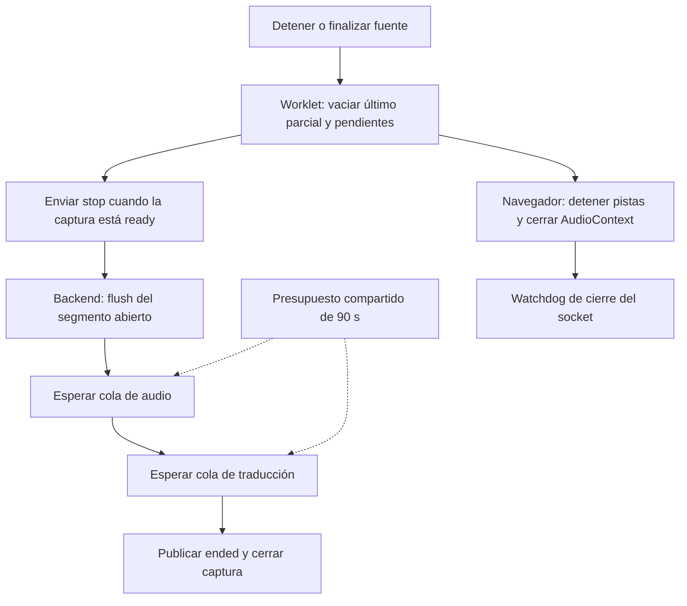

Durante `detecting`, el frontend todavía no marca `ready`; si se detiene en esa fase, cierra el socket en lugar de enviar `stop` como en una captura ya creada. El servidor debe abandonar la detección al desconectarse.

En el camino por segmentos, cada WAV temporal se elimina al completar o fallar su trabajo. El audio completo no se archiva. El backend cancela consumidores al salir de su contexto y restaura el proveedor; el lifespan cierra el cliente Ollama y cancela trabajos de archivo registrados como tareas de fondo. Los sockets de captura tienen además su propio ciclo ASGI y limpieza `finally`.

### Admisión y reservas pendientes

La aplicación comprueba un máximo nominal de dos trabajos activos, contando archivos y capturas ya registradas. También limita la creación de capturas cuando el catálogo llega a 20 sesiones; los runs de archivo tienen un límite separado de 20 entradas en `audio_sources`. Las sesiones terminadas continúan en RAM hasta reiniciar.

**Límite conocido del modo `auto`:** la comprobación se hace antes de detectar, pero el trabajo se registra después. Varias capturas pueden estar detectando a la vez sin ocupar todavía un cupo, y no se repite la admisión al terminar la detección. Falta una reserva atómica que cubra esta fase. Los límites nominales no deben describirse como un aislamiento duro para carga no confiable.

## 14. API y configuración

### Superficie HTTP/WebSocket

| Método | Ruta | Comportamiento |
| --- | --- | --- |
| GET | `/health` | Proceso HTTP responde; no comprueba modelos ni Gemini |
| GET | `/health/ready` | Estado de preparación local; `disabled` también responde 200 |
| GET | `/api/v1/providers` | Default por entorno y presencia de clave |
| GET | `/api/v1/sessions` | Catálogo en memoria |
| GET | `/api/v1/sessions/{id}` | Metadata; 404 si no existe |
| WS | `/api/v1/sessions/{id}/events` | Snapshot inicial y eventos; sesión inexistente se rechaza |
| WS | `/api/v1/capture?language=en\|es\|auto&provider=local\|gemini` | Captura PCM; exige modo demo habilitado |
| GET | `/api/v1/sessions/{id}/audio` | WAV asociado a una sesión de archivo registrada |
| POST | `/api/v1/sessions/{id}/runs` | Crea otra sesión para el mismo WAV, sin iniciar inferencia |
| POST | `/api/v1/sessions/{id}/start` | Inicia trabajo de archivo; idempotente mientras ese trabajo está activo |

No hay endpoint para subir cualquier archivo ni para que el backend descargue una URL arbitraria. Los WAV se asocian a sesiones conocidas. Para repetir un archivo terminado hay que crear un run nuevo.

Los rechazos de captura distinguen internamente 4403 (modo/idioma/proveedor/clave), 1013 (modelos locales no preparados), 4429 (capacidad) y 4408 (detección no completada). La audiencia inexistente usa 4404. **Cuando el cierre ocurre antes de aceptar el WebSocket, puede observarse como HTTP 403 en el handshake**, sin recibir el código específico en JavaScript. El frontend todavía muestra mensajes genéricos para varios de estos casos.

### Variables del backend

Los valores siguientes son defaults **del código**, no una lectura de secretos o configuración particular de una máquina.

| Variable | Default | Efecto |
| --- | --- | --- |
| `DECILO_ENV_FILE` | `.env` en la raíz inferida del proyecto | Archivo de configuración; no sustituye variables exportadas |
| `DECILO_DEMO_SESSIONS` | Deshabilitado si no es `1` | Habilita muestras, inicio de archivos y captura de pestaña |
| `DECILO_DEMO_AUTOSTART` | `1` dentro del modo demo | Arranca automáticamente los WAV; usar `0` para prueba manual |
| `DECILO_AI_PROVIDER` | `local` | Proveedor base |
| `DECILO_STT_PROVIDER` | Hereda el base | Proveedor del reconocimiento |
| `DECILO_TRANSLATION_PROVIDER` | Hereda el base | Proveedor de traducción |
| `GEMINI_API_KEY` | Sin clave | Credencial solo de backend |
| `DECILO_GEMINI_MODEL` | `gemini-3.5-flash-lite` | Modelo REST de traducción y STT por segmentos |
| `DECILO_GEMINI_THINKING` | `MINIMAL` | Thinking REST; vacío omite el campo |
| `DECILO_GEMINI_LIVE` | `1` | Captura con Live si STT es Gemini; solo `0` lo desactiva |
| `DECILO_GEMINI_LIVE_MODEL` | `gemini-3.5-transcribe-live` | Modelo de la conexión STT Live |
| `DECILO_WHISPER_FAST` | `base` | Modelo local provisional |
| `DECILO_WHISPER_ES` | `small` | Modelo local final ES; EN final permanece small |
| `DECILO_PREWARM` | Deshabilitado si no es `1` | Prepara Whisper EN/ES y Ollama en segundo plano |
| `DECILO_PARTIALS` | `1` | ASR provisional y señal textual del camino por segmentos; no afecta Live |
| `DECILO_TRANSLATION_QUEUE` | Deshabilitada si no es `1` | Solapa ASR final y traducción |
| `DECILO_STREAM_TRANSLATION` | Deshabilitada si no es `1` | Traducción progresiva si el proveedor la implementa |
| `DECILO_OLLAMA_KEEP_ALIVE` | `5m` | Residencia pedida en preparación y streaming de Ollama |
| `DECILO_SEGMENTATION` | `pause` | Segmentador acústico o `fixed` |
| `DECILO_MIN_SEGMENT_SECONDS` | `1` | Duración mínima del segmento |
| `DECILO_PAUSE_SECONDS` | `0.4` | Silencio consecutivo para corte |
| `DECILO_MAX_SEGMENT_SECONDS` | `6` | Máximo, validado hasta 15 s |
| `DECILO_SILENCE_RMS` | `0.01` | Umbral de energía |

`DECILO_BACKEND_URL` es una variable de **Vite**: modifica el destino de su proxy, por defecto `http://127.0.0.1:8000`. Cambiar el `.env` del backend no reconfigura automáticamente Vite.

### Preparación de modelos

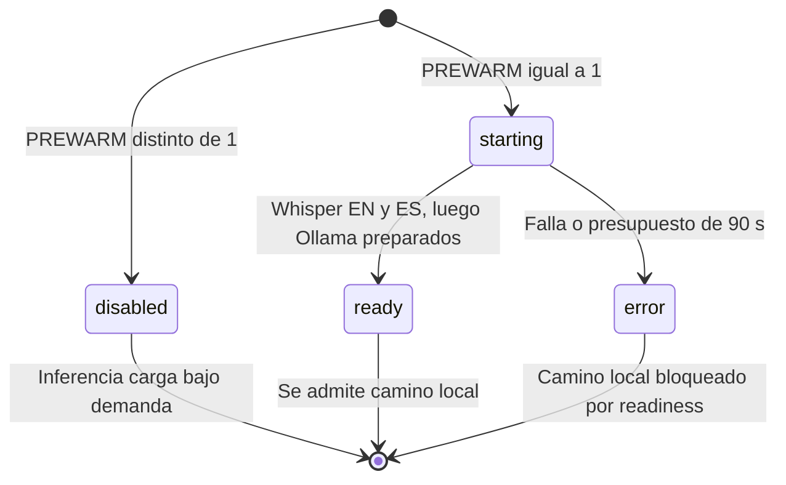

`disabled` significa «sin precarga», no «modelos comprobados». Una captura local puede cargar el modelo con su primer audio. La precarga es local aun con Gemini seleccionado globalmente. Prepara los modelos finales (EN/ES comparten small por defecto) y Ollama, pero no el provisional base ni una conexión Live. Una falla de precarga no bloquea una captura explícita de nube con idioma fijo; `/health/ready` sigue describiendo la preparación local, no la disponibilidad integral de todos los proveedores.

## 15. Operación y diagnóstico

### Arranque reproducible de desarrollo

Desde la raíz del worktree que será dueño del backend, con Python 3.12+, `uv`, Node y Ollama instalados:

```sh
uv sync --group dev
npm --prefix frontend ci
```

Para el camino local, tener Ollama activo y el modelo `gemma3n:e2b` disponible. Whisper carga/obtiene sus modelos cuando se necesitan. El arranque del servidor no implica que ya estén residentes.

Crear `.env` ignorado por Git con la configuración deseada. Ejemplo sin credenciales:

```dotenv
DECILO_AI_PROVIDER=local
DECILO_DEMO_SESSIONS=1
DECILO_DEMO_AUTOSTART=0
DECILO_PREWARM=0
DECILO_SEGMENTATION=pause
DECILO_TRANSLATION_QUEUE=1
DECILO_PARTIALS=1
DECILO_STREAM_TRANSLATION=0
DECILO_GEMINI_MODEL=gemini-3.5-flash-lite
DECILO_GEMINI_THINKING=MINIMAL
DECILO_GEMINI_LIVE=1
DECILO_GEMINI_LIVE_MODEL=gemini-3.5-transcribe-live
```

Para ofrecer nube, agregar `GEMINI_API_KEY` solo al archivo local o al entorno del proceso. Configurar `DECILO_AI_PROVIDER=gemini` cambia el default del backend; la elección explícita del navegador sigue teniendo prioridad.

```sh
DECILO_ENV_FILE="$PWD/.env" DECILO_DEMO_SESSIONS=1 DECILO_DEMO_AUTOSTART=0 \
  uv run uvicorn decilo.app:app --host 127.0.0.1 --port 8000
```

En otra terminal:

```sh
npm --prefix frontend run dev
```

Abrir `http://localhost:5173`, cargar el video, elegir proveedor/idioma, compartir **la pestaña con audio** y reproducir. Seleccionar idioma explícito evita el tiempo inicial de autodetección. Detener la captura deja terminar lo pendiente; pausar YouTube no es equivalente a cerrar la captura.

Las dos carpetas de trabajo pueden servir frontend/backend por separado, pero debe haber **un único dueño de cada puerto** y un archivo de entorno explícito. Un frontend actualizado puede conectarse a un backend iniciado sin modo demo o sin clave: el selector de Chrome funcionará aunque la conexión posterior sea rechazada.

### Diagnóstico por frontera

| Síntoma | Comprobación concreta |
| --- | --- |
| No carga la página | Vite en 5173; es distinto del servidor API |
| Selector de nube deshabilitado | `/api/v1/providers` y archivo de entorno cargado; no pegar la clave en el frontend |
| Chrome permite elegir, pero no empieza | Handshake de `/api/v1/capture`, modo demo, idioma, readiness y capacidad |
| Captura sin audio | Pista de audio en el permiso; compartir pestaña con audio, no asumir que compartir pantalla lo incluye |
| `auto` demora | Audio inicial, carga de Whisper y detección local |
| Texto original antes que español | Comportamiento de fallback visual; traducción espera original final |
| Texto atrasado o gaps | Colas, costo de ASR/traducción y competencia entre sesiones |
| Falta parte del historial | Retención de 100 segmentos/1 MiB, reinicio o sesión equivocada |
| Local falla tras arrancar | Ollama/modelo, caché de Whisper y logs; readiness disabled no comprueba inferencia |

## 16. Privacidad y límites de exposición

El navegador autoriza la fuente de audio. El backend recibe PCM, no video; no accede al micrófono. El iframe sigue comunicándose con YouTube independientemente del proveedor de IA elegido.

En modo local, el audio de captura viaja al servidor Decilo y se procesa allí. «Local» significa **local al backend**, no procesamiento dentro del navegador: si se despliega en otra máquina, el audio sale del equipo del espectador. En la demo ambos están en el mismo equipo.

En modo nube, Gemini recibe audio para STT y texto para traducción. Las claves permanecen en backend, `.env` no se versiona y el catálogo solo informa su presencia. El camino por segmentos crea WAV temporales; Live envía PCM directamente. No hay almacenamiento deliberado de la charla completa, exportación ni política de archivo persistente.

El prototipo no implementa autenticación, autorización por sesión, límites por usuario, cuotas de gasto ni validación de origen del WebSocket. El gate de modo demo es una configuración, no un sistema de acceso. El comando local limita la escucha; antes de exponerlo públicamente harían falta esas fronteras, TLS y una política de retención. La CI actual tampoco constituye una auditoría de seguridad.

## 17. Escalabilidad y evolución

### Escalar espectadores y escalar fuentes son problemas distintos

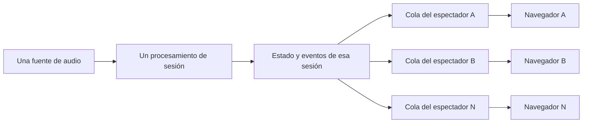

Agregar espectadores no multiplica solicitudes al modelo, pero sí memoria de colas, serialización/envío y ancho de banda. Agregar fuentes sí agrega ASR y traducción; en CPU las sesiones compiten. El límite de dos trabajos evita una sobrecarga obvia en la demo, no demuestra que dos charlas cumplan el objetivo de latencia.

No se puede escalar simplemente con `uvicorn --workers N`: cada proceso tendría un registro distinto. Catálogo, socket de captura y socket de audiencia podrían caer en procesos sin la misma sesión. También se duplicarían cachés de modelos y presupuestos nominales por proceso.

### Despliegue distribuido propuesto, no implementado

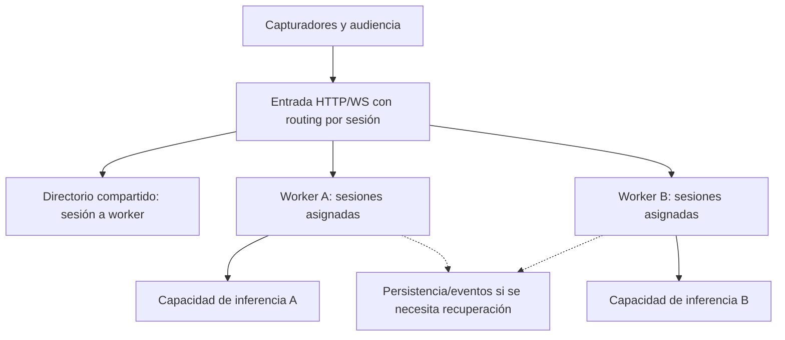

Una primera evolución puede asignar cada sesión a una instancia y dirigir **tanto ingreso como audiencia** a su propietario. El catálogo requeriría agregación o almacenamiento compartido. Si se necesita migración o recuperación después de caída, además hace falta persistir estado/eventos; afinidad de routing por sí sola no recupera una charla perdida.

Antes de aumentar capacidad: reservar cupos durante detección, medir cómputo por proveedor, separar recursos de ASR/traducción, aplicar límites globales y elegir hardware/modelos según evidencia. Cambiar a una cola externa no acelera el modelo ni resuelve un consumidor más lento que el audio.

### Diferenciales y puntos de extensión

| Evolución | Punto actual donde incorporarla | Trabajo pendiente |
| --- | --- | --- |
| Límites por unidades de sentido | Cortes heurísticos locales/Live ya implementados | Validar estabilidad, tiempos, motivo de corte y presupuesto semántico; no equivalen a comprensión validada |
| Traducción especulativa | `translate_caption`, `source_revision` y `SessionStream` | Scheduler de revisiones provisionales y presupuesto de inferencia |
| Control dinámico de latencia | Métricas de `pipeline.py` y parámetros de segmentación | Controlador con histéresis y evaluación calidad/latencia; hoy los parámetros son estáticos |
| Glosario y contexto | Prompt de `translate.py` y entrada al adaptador | Contexto por sesión acotado, prioridad de términos y validación de candidatos |
| Perfiles regionales | `Session.target_locale` | Despacho real de políticas de traducción por perfil |
| Diarización | `CaptionData.speaker_id` | Detector y atribución temporal; identidad desconocida explícita |
| Contexto visual | Fuente de captura e interfaces nuevas | Canal de video, sincronización y análisis selectivo; actualmente solo se transmite audio |
| Audio comprimido | Worklet/transporte e ingreso PCM | Codec y decodificación; conservar offsets y límites |
| Exportación SRT/VTT | Eventos confirmados | Almacenamiento completo y exportador; snapshot de 100 segmentos no alcanza |
| Recuperación de sesiones | Registro y gateway | Persistencia, ownership y política de replay |

## 18. Pruebas y evidencia

### CI existente

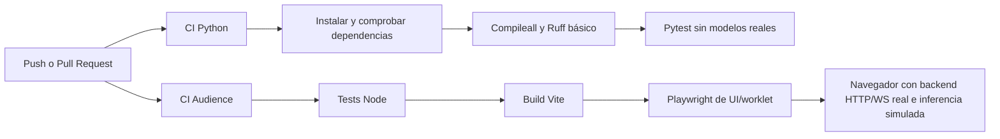

La CI compila bytecode de Python y construye el frontend; no genera un binario del backend ni despliega la demo. Los workflows están en [ci.yml](../.github/workflows/ci.yml) y [audience.yml](../.github/workflows/audience.yml). Sonar y CodeRabbit no forman parte de estos jobs.

| Área | Pruebas de referencia |
| --- | --- |
| Validación y contratos | `test_models.py`, `test_sessions.py`, `test_stream.py` |
| Clientes lentos y limpieza | `test_gateway.py` |
| Formato PCM, buffers y stop | `test_capture.py`, `frontend/tests/browser/worklet.spec.js` |
| Límites acústicos | `test_segmentation.py` |
| ASR provisional y detección | `test_partials.py`, `test_language_detection.py` |
| Proveedores y aislamiento | `test_providers.py`, `test_provider_selection.py`, `test_gemini_live.py` |
| Preparación y streaming | `test_preparation.py`, `test_translation_stream.py` |
| Revisión/reconexión/UI | `frontend/tests/state.test.js`, `frontend/tests/connection.test.js`, `frontend/tests/browser/ui.spec.js` |
| Recorrido navegador/backend | `frontend/tests/integration/gateway.spec.js` |

`tests/conftest.py` aísla las pruebas sin modelos del `.env` real y bloquea transportes HTTP de inferencia. No bloquea todos los sockets: las conexiones Live deben simularse en sus tests. La integración utiliza servidor, WebSockets y worklet reales con inferencia simulada. Eso verifica contratos y recorridos, no precisión del ASR ni calidad de traducción.

### Medición

[`scripts/measure_latency.py`](../scripts/measure_latency.py) ofrece corridas de archivos con una/dos sesiones, warmup, beam 1/5, cola de traducción y segmentación fija/pausas. Registra tiempos de ASR, traducción, espera, primera publicación/final, gaps y WER cuando hay referencia. `--keep-all` permite una comparación de archivo sin descarte por atraso.

El medidor de archivos no ejercita por sí solo el ASR provisional de captura ni el render de la barra. La métrica de WER corresponde a originales, no a fidelidad de traducción. No deben sumarse duraciones de etapas que se solapan ni restarse directamente `performance.now()` del navegador y el reloj monotónico de Python.

Evidencia conservada, con sus configuraciones y límites originales:

- [Perfil por etapas](validation/2026-09-25-stage-profile/README.md): evidencia de contención y atraso con dos sesiones locales en CPU.
- [Cola de traducción](validation/2026-09-25-translation-queue/README.md): comparación acotada de serial frente a solapamiento.
- [Segmentación por pausas](validation/2026-09-25-pause-segmentation/README.md): límites acústicos; no prueba comprensión de significado.
- [Traducción progresiva](validation/2026-09-25-streaming-translation/README.md): primera salida de Ollama anterior al final, con arranque frío incluido.
- [Prueba mínima de nube](validation/2026-09-25-cloud-backend/README.md): un fragmento sintético con Gemini **3.8 Flash**, anterior al cambio de modelo. No es un benchmark de 3.1 Flash-Lite, del nuevo perfil 3.5 ni de Gemini Live.
- [Avance incremental de OpenSpec](../openspec/changes/backend-latencia-incremental/tasks.md): registros de Claude para PRs #20–#22, incluidos smokes de Live y cortes; evaluación sostenida pendiente.
- [Índice de evidencia histórica](validation/README.md): identifica qué resultados preceden a los modelos/caminos nuevos. Las cifras breves reportadas por Claude no se extrapolan a p95, dos sesiones o toda la charla.

La preparación de este documento no ejecuta inferencia ni añade mediciones de rendimiento. La aceptación de capacidad requiere todavía audio humano, dos fuentes simultáneas, prueba sostenida, pérdidas, precisión y tiempo hasta el español visible; no basta con que la conexión o los tests de protocolo pasen.
