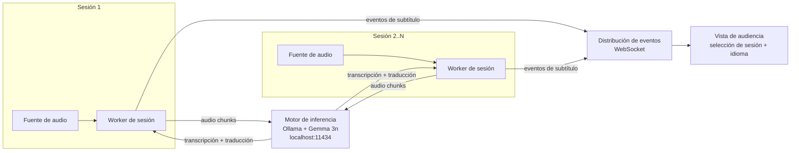

# Design

## Context

Ver `proposal.md` - Why. Restricciones conocidas: notebook de desarrollo
sin GPU dedicada (Intel Iris Xe, CPU-only para inferencia), Ollama
corriendo local exponiendo su API HTTP en `localhost:11434`, deadline el
25/09/2026 12:00 ART. El reparto de tareas entre Claude y Codex todavía no
está decidido; este documento no depende de esa decisión.

## Goals / Non-Goals

**Goals:**
- Dejar un diagrama de componentes de alto nivel y las decisiones técnicas
  que lo sostienen, para que Claude y Codex implementen sin volver a
  discutir el "cómo" de nivel arquitectónico.
- Que las decisiones respeten los drivers definidos en
  `specs/system-architecture/spec.md` (latencia, escalabilidad, aislamiento
  de fallos, documentación de despliegue) y los drivers adicionales no
  testeables como requirement (costo, extensibilidad, velocidad de
  desarrollo bajo el plazo del hackathon).

**Non-Goals:**
- No define el contrato exacto de eventos de sesión/subtítulos (formato,
  campos, parcial vs. definitivo) — eso es un cambio aparte, acordado en
  `COLLABORATION.md` entre Claude y Codex.
- No elige el framework de la vista de audiencia (frontend).
- No decide el reparto de tareas entre Claude y Codex.

## Decisiones de drivers (no todos son requirements testeables)

Los siguientes drivers guían las decisiones de este documento aunque no
todos generan un requirement verificable en `spec.md`:

1. **Latencia** (requirement en spec.md) — el más crítico: es criterio
   explícito del jurado y condiciona la usabilidad del producto.
2. **Escalabilidad horizontal** (requirement en spec.md).
3. **Aislamiento de fallos por sesión** (requirement en spec.md).
4. **Documentación de despliegue reproducible** (requirement en spec.md).
5. **Precisión con términos técnicos** — driver real (criterio "Calidad"
   del jurado) pero el desafío lo marca como mejora opcional (glosario);
   no se exige en el MVP. Se deja como principio de diseño: el motor de
   inferencia debe permitir inyectar contexto/glosario sin cambiar código.
6. **Costo operativo** — preferir ejecución local sin costo por token
   mientras sea viable con los drivers de latencia/calidad.
7. **Extensibilidad** — dejar lugar para más idiomas, export SRT/VTT,
   integración OBS/vMix y panel de monitoreo (todos opcionales del
   desafío) sin reescribir el núcleo.
8. **Velocidad de desarrollo bajo el plazo del hackathon** — tensiona con
   la elección de Rust; se aborda explícitamente en la decisión de
   lenguaje, abajo.

## Diagrama de componentes (alto nivel)

Cada sesión es un worker aislado (proceso/tarea async independiente) que
comparte la misma instancia del motor de inferencia. Escalar a más
sesiones significa agregar workers y, si hace falta, más instancias del
motor de inferencia detrás de un balanceador simple — no rediseñar el
flujo.

## Decisions

### Lenguaje/runtime del backend: Rust (async, con tokio)

**Por qué:** alinea con el driver de latencia (bajo overhead de runtime,
sin GC, buen control de memoria y concurrencia real para muchos workers de
audio en paralelo con CPU-only).

**Alternativas consideradas:**
- Python: ecosistema ML más maduro para prototipar rápido, pero el GIL y
  el overhead por proceso complican correr muchas sesiones concurrentes
  con baja latencia sin arquitectura adicional (multiprocessing).
- Node.js/TypeScript: buen modelo async para I/O, pero el trabajo pesado
  de inferencia lo hace Ollama fuera de proceso en ambos casos — la
  diferencia real está en el manejo de audio en tiempo real y la
  velocidad de desarrollo, donde Node es más rápido para arrancar que
  Rust.

**Riesgo aceptado:** menor velocidad de desarrollo en Rust bajo un plazo
de ~19hs. Mitigación: usar crates de alto nivel (`axum` para HTTP/
WebSocket, `reqwest` para hablar con la API de Ollama, `cpal` para
captura de audio) y mantener el alcance del MVP acotado a lo mínimo que
pide el desafío.

### Transporte de subtítulos: WebSocket

Push del servidor a la vista de audiencia en vez de polling HTTP, para
cumplir el driver de latencia. El formato exacto de los eventos se define
en un cambio aparte (ver Non-Goals).

### Motor de inferencia: local, vía Ollama + Gemma 3n

Corre 100% local llamando a la API HTTP de Ollama (`localhost:11434`) con
`gemma3n:e4b`, alineado con el driver de costo y con la opción "100%
local" que ofrece el desafío. La alternativa (API de audio de Gemini en la
nube, sugerida por los organizadores) queda descartada por ahora para no
depender de conectividad/API keys durante el evento, pero puede
documentarse como fallback si el spike de audio (ver Open Questions) no
da resultado a tiempo.

## Risks / Trade-offs

- [Riesgo] Rust reduce la velocidad de desarrollo bajo el plazo del
  hackathon → [Mitigación] crates de alto nivel + alcance de MVP acotado
  (ver Decisions).
- [Riesgo] CPU-only (sin GPU dedicada) puede no cumplir el límite de 3s de
  latencia (p95) definido en `spec.md` con `gemma3n:e4b` → [Mitigación]
  medir temprano con un spike; si no alcanza, degradar a `gemma3n:e2b` o a
  un pipeline Whisper (STT) + Gemma 3 texto para la traducción, sin
  cambiar el diagrama de componentes.
- [Riesgo] No está confirmado que Gemma 3n vía la API de Ollama soporte
  audio de entrada con calidad/latencia utilizable → ver Open Questions.

## Open Questions

- ¿Gemma 3n vía Ollama soporta audio de entrada real, con calidad y
  latencia utilizables en esta notebook (CPU-only)? Se resuelve con un
  spike temprano de implementación. Si no da resultado, el motor de
  inferencia pasa a Whisper (STT) + Gemma 3 texto para la traducción — el
  diagrama de componentes y los drivers no cambian, solo la
  implementación interna del componente "Motor de inferencia".
