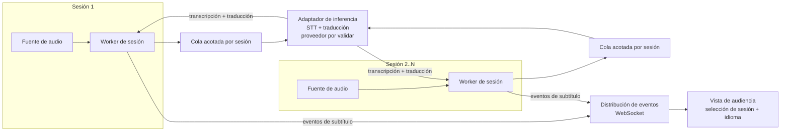
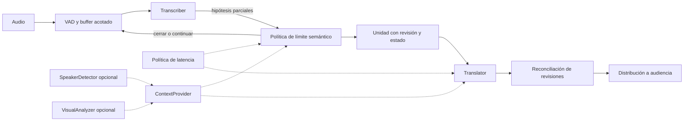

# Design

## Context

Ver `proposal.md` - Why. Restricciones conocidas: notebook de desarrollo
sin GPU dedicada (Intel Iris Xe, CPU-only para inferencia), Ollama
corriendo local exponiendo su API HTTP en `localhost:11434`, deadline el
25/09/2026 12:00 ART. El reparto de tareas entre Claude y Codex todavía no
está decidido; este documento no depende de esa decisión.

**Revisión de Codex (2026-09-24):** drivers aprobados con las correcciones
registradas aquí y en `spec.md`. Rust y la meta propuesta de 3s p95 siguen
pendientes de confirmación del usuario (tarea 2.2). El motor y su capacidad
siguen pendientes de evidencia técnica; esta revisión no aprueba una
implementación ni demuestra rendimiento.

La lluvia de ideas posterior del usuario se conserva en
[`VISION.md`](../../../VISION.md), ya alineado con Python (2026-09-24).
Los ejemplos de latencia de `VISION.md` no constituyen por sí solos
criterios confirmados.

## Goals / Non-Goals

**Goals:**
- Dejar un diagrama de componentes de alto nivel y las decisiones técnicas
  que lo sostienen, para que Claude y Codex implementen sin volver a
  discutir el "cómo" de nivel arquitectónico.
- Que las decisiones respeten los drivers definidos en
  `specs/system-architecture/spec.md` (latencia, escalabilidad, aislamiento
  de fallos, documentación de despliegue) y los drivers adicionales no
  testeables como requirement (costo, extensibilidad, velocidad de
  desarrollo bajo el plazo del hackathon).

**Non-Goals:**
- No define el contrato exacto de eventos de sesión/subtítulos (formato,
  campos, parcial vs. definitivo) — eso es un cambio aparte, acordado en
  `COLLABORATION.md` entre Claude y Codex.
- No elige el framework de la vista de audiencia (frontend).
- No decide el reparto de tareas entre Claude y Codex.

## Decisiones de drivers (no todos son requirements testeables)

Los siguientes drivers guían las decisiones de este documento aunque no
todos generan un requirement verificable en `spec.md`:

1. **Latencia** (requirement en spec.md) — el más crítico: es criterio
   explícito del jurado y condiciona la usabilidad del producto.
2. **Escalabilidad horizontal** (requirement en spec.md).
3. **Aislamiento de fallos por sesión** (requirement en spec.md).
4. **Documentación de despliegue reproducible** (requirement en spec.md).
5. **Precisión de transcripción y traducción** — junto con latencia y dos
   sesiones funcionales, es condición central de utilidad y criterio del
   jurado. Lo opcional es el mecanismo de glosario, no la calidad. Evaluar
   audio representativo en español e inglés y traducción EN→ES antes de
   elegir el motor. Contexto y glosario son diferenciales de la visión:
   incorporarlos por etapas después del pipeline real, conservando desde
   el inicio una interfaz para suministrarlos.
6. **Costo operativo** — preferir ejecución local sin costo por token
   mientras sea viable con los drivers de latencia/calidad.
7. **Extensibilidad** — preservar segmentación semántica, especulación,
   control adaptativo, glosario, regionalización, hablantes y contexto
   visual de `VISION.md`. Mantener también más idiomas, export SRT/VTT,
   integración OBS/vMix y panel de monitoreo sin reescribir el núcleo.
8. **Velocidad de desarrollo bajo el plazo del hackathon** — tensiona con
   la elección de Rust; se aborda explícitamente en la decisión de
   lenguaje, abajo.

## Diagrama de componentes (alto nivel)

Cada sesión tiene estado, cola, cancelación y timeout propios. Una tarea
async da separación lógica, pero no aislamiento frente a caída del proceso,
OOM o caída del motor compartido. Errores locales se contienen y se informan;
la alta disponibilidad del host y de servicios compartidos queda fuera del MVP.

El adaptador permite asignar sesiones a instancias de inferencia mediante
configuración. Agregar workers no agrega capacidad de inferencia por sí solo:
medir CPU/RAM, cola y latencia con dos sesiones antes de recomendar 5–10.
Mantener contexto y orden por sesión; limitar concurrencia y repartir turnos
para evitar que una sesión monopolice el motor. No hace falta implementar un
balanceador distribuido para demostrar el MVP.

## Decisions

### Límites de componentes para la visión incremental

El diagrama anterior muestra el camino mínimo entre sesiones, inferencia y
audiencia. El interior del adaptador debe permitir esta evolución lógica;
las piezas opcionales no necesitan servicios separados ni ejecución inicial:

La segmentación semántica recibe hipótesis del ASR, sin exigir una unidad
completa antes de transcribir. Necesita un tiempo máximo de espera para
habla continua. Si el proveedor solo devuelve resultados por ventanas,
evaluar un adaptador incremental; no prometer parciales nativos sin probarlos.

El contrato posterior debe incluir identidad de segmento, revisión,
referencia a la revisión original para traducciones y reglas de confirmación.
La estabilidad de traducción es independiente de la del ASR. Un resultado
tardío no debe reemplazar uno más reciente. La política de corrección de
texto confirmado se hará explícita antes de implementar el accurate path.

Contexto/glosario tienen alcance y memoria acotados por sesión; el perfil
regional es configurable. Hablante y video son aportes opcionales con
tiempos y procedencia, nunca requisitos para que avance el audio.
El controlador consume métricas y elige una política; no genera contenido.
Medir costos antes de habilitar dos caminos o cambios de modelo, y evitar
oscilaciones con histéresis. Go y un broker externo no son dependencias
necesarias para conservar estas interfaces.

### Lenguaje/runtime del backend: Python (confirmado, 2026-09-24)

**Por qué:** el trabajo pesado del pipeline (inferencia de Whisper vía
`faster-whisper`/`whisper.cpp`, inferencia de traducción vía la API HTTP
de Ollama) corre como proceso o motor externo compilado sea cual sea el
lenguaje que lo orqueste — ninguno de los dos se vuelve más rápido por
escribir el pegamento alrededor en Rust. Lo que sí cambia con el lenguaje
es cuánto tarda en escribirse y ajustarse ese pegamento (captura de audio,
sesiones, WebSocket, contrato de eventos que todavía se negocia con
Codex), y ahí Rust tiene un costo real bajo el plazo del hackathon: ciclo
compilar-editar-probar más lento, más fricción para iterar sobre un
contrato que puede seguir cambiando. `asyncio` maneja sin problema la
concurrencia de I/O necesaria en esta escala (2-10 sesiones): llamadas a
Ollama, WebSocket a la audiencia y subprocesos de Whisper son E/S, no
cómputo Python puro, así que el GIL no es la restricción relevante aquí
(ver corrección de Codex más arriba).

**Alternativas consideradas:**
- Rust (async, con tokio): preferencia original del usuario por un
  backend nativo, control de memoria y concurrencia. Se descarta como
  lenguaje de partida — no por rendimiento de inferencia (que no depende
  del lenguaje orquestador) sino por el costo de velocidad de desarrollo
  bajo el plazo. Sigue disponible como reescritura posterior de piezas
  puntuales si el tiempo lo permite y un perfil muestra que el overhead
  de la orquestación (no el de whisper.cpp/Ollama) es el cuello de
  botella real.
- Node.js/TypeScript: modelo async similar a Python para este caso de
  uso; se prefiere Python por el ecosistema más maduro de bindings a
  Whisper (`faster-whisper`) y por familiaridad esperada del equipo con
  librerías de audio/ML en Python.

**Riesgo aceptado:** overhead de Python en el camino caliente si el
pipeline creciera a mucha más concurrencia o cómputo en proceso. Mitigación:
delegar todo el cómputo pesado a procesos/binarios externos (whisper.cpp,
Ollama) en vez de reimplementarlo en Python puro; medir con el protocolo
de "Medición y control de sobrecarga" antes de asumir que alcanza para
5-10 sesiones. Construir primero el camino funcional; incorporar los
diferenciales de `VISION.md` por etapas, sin eliminarlos del diseño. La
captura desde navegador requiere acordar su propio transporte.

### Transporte de subtítulos: WebSocket

WebSocket es una opción válida para push y futuras interacciones. SSE
también sirve para subtítulos unidireccionales; WebSocket no es condición
necesaria ni suficiente para cumplir 3s. Mantener esta elección para reducir
decisiones pendientes. Usar buffers acotados por cliente: un espectador
lento no debe bloquear la producción ni a otros espectadores. El contrato
posterior define orden, reconexión y recuperación de segmentos.

### Motor de inferencia: local preferido, proveedor pendiente de validar

La ficha oficial de Ollama publica `gemma3n:e2b` y `gemma3n:e4b` con entrada
**Text**. Que Gemma 3n sea multimodal no demuestra que ese runtime exponga
audio. No aprobar el envío de audio a Ollama como base del pipeline ni
esperar la descarga completa para revisar compatibilidad.

Primero comprobar versión, modalidades y API del runtime instalado. Si no
hay soporte de audio verificable, evaluar directamente STT local (por
ejemplo, Whisper mediante whisper.cpp) y traducción de texto con un modelo
local vía Ollama. Ni Whisper ni el traductor quedan aprobados por nombre:
deben demostrar español, inglés y EN→ES con latencia y calidad útiles.
Un único motor multimodal sigue siendo posible si otro runtime lo soporta
y supera las mismas pruebas.

La operación local reduce dependencia de red una vez descargados modelos;
requiere recursos y tiene costo de hardware. Gemini en la nube queda como
alternativa explícita si el camino local no cumple, sujeta a decidir el
cambio de dependencia de conectividad y credenciales. No activarlo
silenciosamente. Ajustar el README al motor realmente validado.

### Medición y control de sobrecarga

La meta de 3s p95 es una propuesta interna, no una cifra de las bases.
El ejemplo de <1,5s de la lluvia de ideas es una aspiración pendiente de
definir por tipo de salida y percentil. Medir además primer parcial útil,
edad del audio representado, tiempo a definitivo y revisiones visibles;
mostrar texto rápido pero incorrecto no acredita una mejora de calidad.
Medir transcripción definitiva y traducción por separado, por sesión, desde
la captura de la última muestra de voz del segmento hasta su presentación
en el navegador. Incluir la espera por cierre del segmento, cola, inferencia,
traducción, transporte y render. Registrar también duración del segmento y
demora desde su primera muestra para no esconder buffering excesivo.

Protocolo inicial: dos fuentes distintas reproducidas a velocidad real,
al menos 10 minutos y 100 segmentos por sesión; ampliar la duración si
faltan muestras. Registrar hardware, modelos/versiones, cuantización,
segmentación, red y número de espectadores. Separar carga inicial del
modelo de régimen estable, incluyendo el tiempo hasta estar listo. Usar
relojes comparables o un arnés con reloj común; no restar relojes sin sincronizar.
Informar p50/p95, segmentos perdidos, errores y cola; un segmento perdido
no cuenta como entregado dentro de la meta. Un spike sin UI solo mide
inferencia/pipeline y no prueba latencia end-to-end.

Acotar colas y antigüedad del audio pendiente; fijar sus valores con el
benchmark antes de implementar la política. Ante saturación, mostrar estado
degradado y discontinuidad si se descarta audio, limitar admisión o pedir
capacidad adicional. No acumular retraso sin límite ni ocultar pérdidas.
Estado por sesión, logs de errores y mediciones son parte de la operación
mínima; un panel de monitoreo completo sigue siendo opcional.

## Risks / Trade-offs

- [Riesgo] Rust reduce la velocidad de desarrollo bajo el plazo del
  hackathon → [Mitigación] crates de alto nivel + alcance de MVP acotado
  (ver Decisions).
- [Riesgo] CPU-only puede no cumplir 3s p95 con dos sesiones → medir
  temprano, evaluar modelos más pequeños y capacidad adicional. Reducir
  tamaño de un modelo no agrega soporte de audio ni garantiza calidad.
- [Riesgo] Motor compartido saturado o caído afecta varias sesiones →
  colas/timeout acotados, estado visible y capacidad documentada; no prometer
  aislamiento absoluto ni failover inexistente.

## Decisiones pendientes que bloquean el cierre

- ~~Confirmación del usuario de lenguaje y meta de latencia (2.2)~~ —
  resuelto 2026-09-24: Python confirmado como lenguaje del backend, 3s p95
  confirmado como meta de latencia. Ver tasks.md 2.2.
- Confirmado empíricamente (2026-09-24, `ollama show gemma3n:e4b` y
  `curl localhost:11434/api/show`): el runtime local reporta
  `"capabilities":["completion"]` para `gemma3n:e4b` — sin audio ni visión.
  Se descarta el envío de audio directo a Ollama; el motor de STT pasa a
  evaluarse por separado (Whisper/whisper.cpp o `faster-whisper`), ver
  tasks.md 3.1.
- Runtime de STT, modelo de traducción y hardware con evidencia de calidad
  y capacidad concurrente. Resolver en el spike, antes de tratar el diseño
  como implementable y cerrado.
- Contrato compartido de sesiones/eventos: sigue en un cambio posterior;
  acordarlo antes de implementar backend y frontend por separado.
- ~~`VISION.md` nombraba Rust~~ — resuelto 2026-09-24: actualizado a Python
  en "Dirección tecnológica propuesta" y en el Nivel 1 de su tabla de
  progresión, por decisión del usuario.

## Fuentes de la revisión técnica

Consultadas el 2026-09-24:
- [Gemma 3n en Ollama: modalidades publicadas](https://ollama.com/library/gemma3n).
- [Gemma 3n: capacidades del modelo](https://ai.google.dev/gemma/docs/gemma-3n).
- [API de chat de Ollama](https://docs.ollama.com/api/chat).
- [Concurrencia y colas de Ollama](https://docs.ollama.com/faq).
- [Python: GIL y concurrencia de I/O](https://docs.python.org/3/library/threading.html).
- [whisper.cpp: candidato STT local](https://github.com/ggml-org/whisper.cpp).
